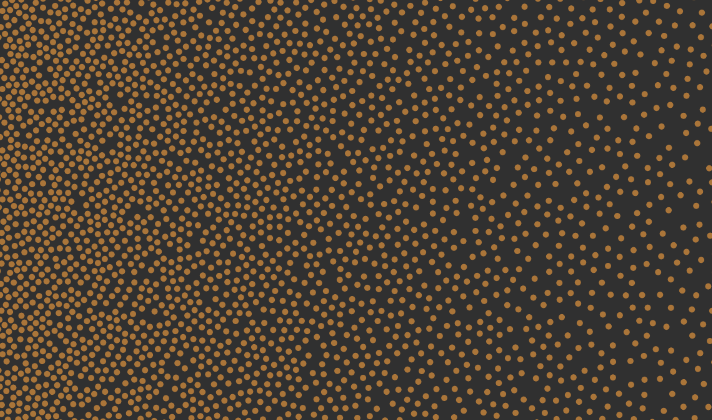

# adaptive-poisson-sampling

This is a library to do 2D blue noise. 2D blue noise is an alternative to
generating a bunch of purely random points in 2D space. Just random noise
looks clump and subjectively unatractive. Poisson noise which is a type of
blue noise attempts to fix this problem by making points that don't clump
together but still aren'tuniform. This regularity can be much more attractive
for things like placing shrubs or trees in a generated landscape.

This library is an addaptive sampling library because it doesn't just generate
a uniform density distribution but can be used to create a series of points
that generally conform to the input function.

[**Take it for a test drive!**](https://evelios.github.io/adaptive-poisson-sampling/example.html)


[](https://evelios.github.io/adaptive-poisson-sampling/example.html)

## Instilation

```sh
npm install --save https://github.com/Evelios/adaptive-poisson-sampling.git
```

##  Usage

This library works in node.js
```js
var poisson = require('adaptive-poisson-sampling');
```

And in the browser! (It includes the global variable `poisson`)
```html
<script type='text/javascript' src='./node_modules/adaptive-poisson-sampling.js'></script>
```

Basic Description:  
`poisson(dimensions, density, [rng, [cell_dist]]);`

Then to use the function you can do the following
```js
var dimensions = [width, height] = [400, 200];
var density = 5; // Average distance between points

// Making uniform density noise
var noise = poisson(dimensions, density);

// returns a list of points [[x, y], [x, y], ...]

// Function takes a vector of the form [x, y] and needs to return a number
var density_function = function(vector) {
  return density + 5 * vector[0] / width;  // Decrease density from left to right
}

// Making a non-uniform density noise
var noise_gradient = poisson(dimensions, density_function);
```

The algoriths takes in a random number generator. For example you can give it
the Alea random number generator and make the sampling algorithm seeded.
By default, the algorithm will use the `Math.random` function.
```js
// Create the random number generator.
var rng = Alea('seed');

// Running this with the same rng and same starting seed will always give the same results
var noise = poisson(dimensions, density_function, rng);
```

You can also specify a minimum cell distance for the points if you would like. By default the minimum cell size is 0.1.
```js
var min_distance = 2;
var noise = poisson(dimensions, density_function, rng, min_distance);
```
